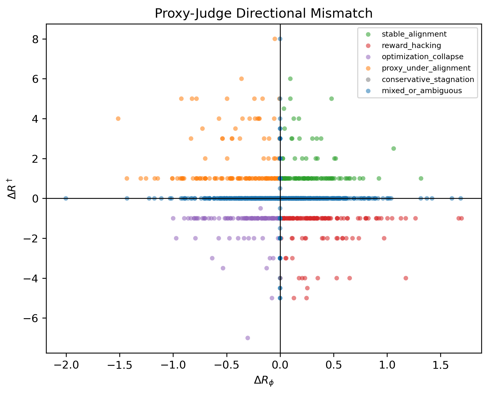
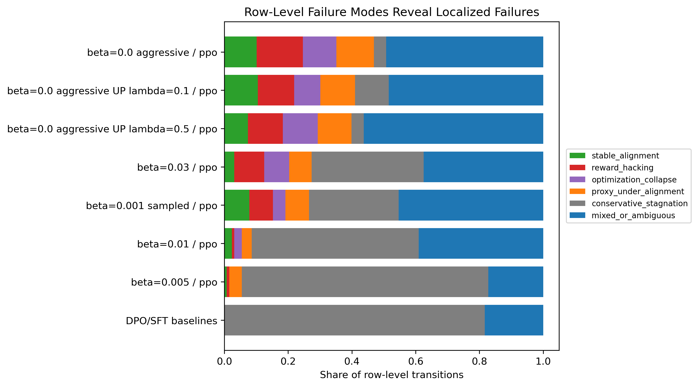
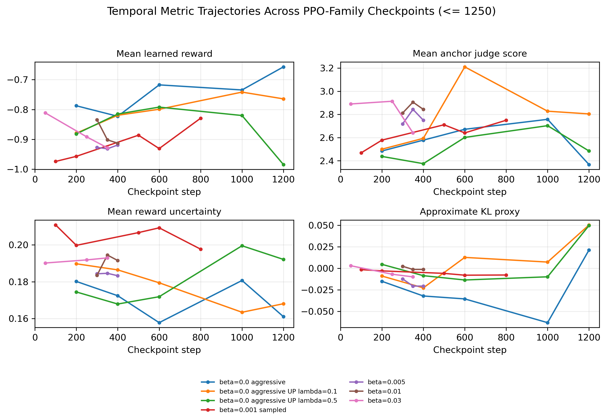
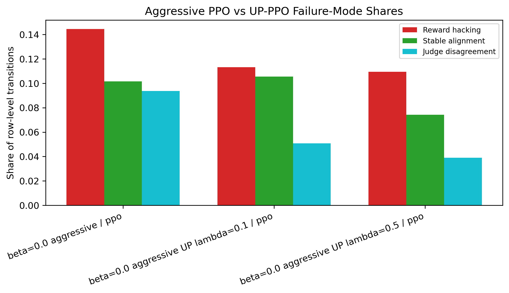

# When RLHF Fails

**A mechanistic taxonomy of reward hacking, optimization collapse, and judge disagreement in RLHF training dynamics.**

[](https://www.python.org/)
[](LICENSE)
[](https://rlhf-failures.zelalem.ai/)
[](https://arxiv.org/abs/2606.03238)

This repository accompanies the paper:

> **When RLHF Fails: A Mechanistic Taxonomy of Reward Hacking, Collapse, and Judge Disagreement**

RLHF failures are often discussed as final-model pathologies. This project studies them as **training dynamics**: when failures emerge, where they localize across prompts, and which signals appear before external quality degrades.

## Abstract

RLHF evaluation should track how failures emerge, where they localize, and which warning signals appear before external quality degrades. We study this problem with a compact RLHF pipeline built for this paper, including PPO, DPO, uncertainty-penalized PPO (UP-PPO), reward-model uncertainty, approximate policy drift, diversity and repetition diagnostics, and two external LLM judges. Rather than treating reward hacking as a single terminal event, we classify matched checkpoint and prompt-level transitions by the directions of learned reward, judge scores, and their average. The main empirical findings are that aggressive PPO produces the clearest localized reward-hacking signal, UP-PPO reduces but does not eliminate that signal, row-level diagnostics reveal failures hidden by checkpoint averages, and pre-transition features partially anticipate future localized reward hacking.

## Links

- **Live demo:** [https://rlhf-failures.zelalem.ai/](https://rlhf-failures.zelalem.ai/)
- **arXiv:** [https://arxiv.org/abs/2606.03238](https://arxiv.org/abs/2606.03238)
- **Code summary:** [`docs/CODE_PIPELINE_SUMMARY.md`](docs/CODE_PIPELINE_SUMMARY.md)
- **Web UI notes:** [`docs/WEB_UI.md`](docs/WEB_UI.md)
- **Manuscript source:** [`paper/when_rlhf_fails.tex`](paper/when_rlhf_fails.tex)

## Key Ideas

The paper separates RLHF transition behavior into an auditable taxonomy:

| Failure mode | Directional signature | Interpretation |
| --- | --- | --- |
| Stable alignment | learned reward increases and judge score increases | Proxy and external quality improve together. |
| Reward hacking | learned reward increases while judge score decreases | The proxy improves while external quality falls. |
| Optimization collapse | learned reward decreases and judge score decreases | Optimization degrades both signals. |
| Proxy under-alignment | learned reward decreases while judge score increases | External quality improves despite proxy decline. |
| Conservative stagnation | both signals remain near zero | Little measurable movement. |
| Judge disagreement | two judges move in opposite directions | The evaluation signal is judge-dependent. |
| Mixed/ambiguous | otherwise | The transition does not fit a strict quadrant. |

## Key Figures

### Proxy-Judge Delta Geometry

Reward hacking is defined directionally: learned reward rises while external judged quality falls.



### Row-Level Failure Modes

Prompt-level diagnostics reveal localized failures that checkpoint averages can hide.



### Temporal Metric Trajectories

Failures emerge over training time, especially under aggressive PPO-family optimization.



### Mitigation Comparison

UP-PPO reduces observed localized reward-hacking and judge-disagreement shares in this controlled setting, but it does not eliminate failures.



## Repository Structure

```text
src/                         RLHF pipeline and failure-mode utilities
scripts/                     Analysis, table, and figure generation scripts
paper/                       Manuscript source and paper figures
figures/                     Generated figure outputs
tables/                      Generated CSV tables used in analysis
web_ui/                      Gradio app for model comparison and diagnostics
docs/                        Pipeline documentation and supporting notes
arxiv_submission_affiliation_updated/  Latest full paper source/PDF staging
tmlr_submission/             Anonymous TMLR submission package
neurips_ai4good_2026/        Anonymous NeurIPS AI4GOOD workshop package
```

## How To Reproduce

Install dependencies:

```bash
python -m venv .venv
source .venv/bin/activate
pip install -r requirements.txt
```

Run the local web UI:

```bash
PYTHONPATH=src python web_ui/app.py
```

Regenerate paper tables and figures from the available analysis tables:

```bash
PYTHONPATH=src python scripts/build_failure_mode_tables.py
PYTHONPATH=src python scripts/make_paper_tables_and_plots.py
PYTHONPATH=src python scripts/run_extended_failure_mode_analyses.py
```

Compile the manuscript:

```bash
cd arxiv_submission_affiliation_updated
pdflatex -interaction=nonstopmode -halt-on-error -jobname=main when_rlhf_fails_v3.tex
pdflatex -interaction=nonstopmode -halt-on-error -jobname=main when_rlhf_fails_v3.tex
```

For a detailed end-to-end description of the training, evaluation, table-generation, and figure-generation flow, see [`docs/CODE_PIPELINE_SUMMARY.md`](docs/CODE_PIPELINE_SUMMARY.md).

## Live Demo

The live demo exposes model comparison and diagnostic views:

[https://rlhf-failures.zelalem.ai/](https://rlhf-failures.zelalem.ai/)

The UI supports side-by-side model comparison, curated failure-mode examples, and trajectory analysis over checkpoint metrics.

## Citation

If you use this repository, please cite:

```bibtex
@misc{abahana2026whenrlhffails,
  title        = {When RLHF Fails: A Mechanistic Taxonomy of Reward Hacking, Collapse, and Judge Disagreement},
  author       = {Abahana, Zelalem and Evans, David and Srinivasan, Satish Mahadevan and Gams, Matja{\v{z}} and Teklu, Henok and Jarachi, Youssef},
  year         = {2026},
  eprint       = {2606.03238},
  archivePrefix = {arXiv},
  note         = {Code and demo available at https://github.com/zabahana/rlhf-failure-modes-diagnostics}
}
```

## License

This project is released under the [`MIT License`](LICENSE).
